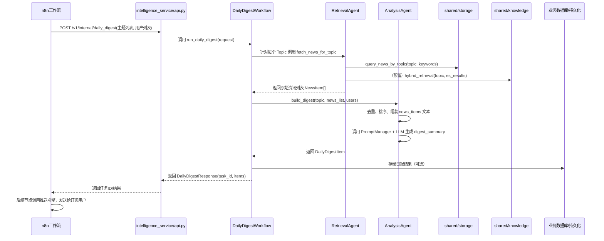
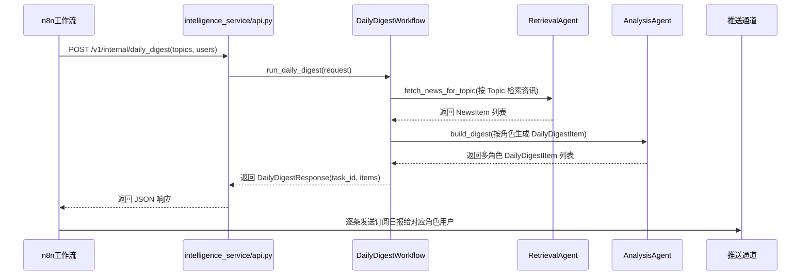

## 情报订阅日报功能设计说明

> 本文档用于说明基于 `intelligence_service` 的“医药资讯订阅日报”功能的设计理念、典型场景和当前实现落点，方便后续协作者理解并继续扩展代码。

---

### 一、业务背景与目标

- **目标用户**：医药行业从业者（BD、医学、市场、研发等），希望订阅某些关注话题的最新资讯。
- **核心诉求**：
  - 能按**主题**（如“PD-1 肺癌”“HER2 乳腺癌 ADC”“中国创新药对外授权”等）订阅资讯；
  - 系统每天/定期自动检索相关资讯，进行**去重、排序、总结**；
  - 以结构化的「订阅日报」形式输出，便于直接推送给用户。
- **当前阶段定位**：
  - 以 **模式 B（local_file ES + Chroma 向量库）** 为主，侧重流程与结构设计；
  - 使用本地 mock 数据 (`data/pharma_news.json`) 模拟真实资讯源；
  - 通过 n8n 等编排工具调用 intelligence_service 的内部接口，完成端到端链路验证。

---

### 二、整体架构与调用链路

#### 2.1 关键参与角色

- **n8n 工作流**：调度与编排层，负责触发订阅日报任务、后续推送等。
- **`intelligence_service/api.py`**：情报服务 API 层，对外暴露 HTTP 接口。
- **情报工作流（workflow）**：
  - 已有：`run_intelligence_pipeline`（分析一个 query）；
  - 规划中：`run_daily_digest`（针对多个订阅主题生成日报）。
- **检索智能体 `RetrievalAgent`**：
  - 位置：[retrieval_agent.py](file:///d:/LingNexus/core_agents/intelligence_service/agents/retrieval_agent.py)
  - 职责：基于主题从 ES/local_file 数据中检索相关医药资讯。
- **分析智能体 `AnalysisAgent`**：
  - 位置：[analysis_agent.py](file:///d:/LingNexus/core_agents/intelligence_service/agents/analysis_agent.py)
  - 职责：对已检索的资讯进行去重、排序、聚合，并调用大模型生成订阅日报摘要。
- **存储层 `shared/storage`**：
  - [es_client.py](file:///d:/LingNexus/shared/storage/es_client.py)：ES 客户端（local_file / remote_es）。
  - [es_query_medical.py](file:///d:/LingNexus/shared/storage/es_query_medical.py)：医药业务检索封装（新增 `query_news_by_topic`）。
- **知识层 `shared/knowledge`**：
  - [vector_store.py](file:///d:/LingNexus/shared/knowledge/vector_store.py)：向量库（none/chroma/milvus）。
  - [rag_engine.py](file:///d:/LingNexus/shared/knowledge/rag_engine.py)：RAG 逻辑预留位，后续用于 hybrid 检索。
- **Prompt 管理层 `shared/prompts`**：
  - [manager.py](file:///d:/LingNexus/shared/prompts/manager.py)：PromptManager 统一管理；
  - [intelligence.yaml](file:///d:/LingNexus/shared/prompts/intelligence.yaml)：情报服务 Prompt 配置，新增订阅日报 Prompt：`intelligence_daily_digest_v1`。

#### 2.2 时序图（订阅日报业务流）

#### 2.3 n8n 联动与推送流程

---

### 三、数据与配置设计

#### 3.1 本地 Mock 数据（模式 B）

- **资讯数据文件**：`data/pharma_news.json`
  - 用于模拟真实医药资讯源，字段包括：
    - `id`: 资讯 ID
    - `title`: 标题
    - `summary`: 摘要
    - `source`: 来源（FDA、NEJM、企业新闻稿等）
    - `category`: 分类（如“肿瘤-肺癌”“BD-对外授权”）
    - `tags`: 标签数组
    - `published_at`: 发布时间（字符串形式）
    - `url`: 原文链接
  - 在 [es_client.py](file:///d:/LingNexus/shared/storage/es_client.py) 中通过 `_load_local_data` 加载为索引：`pharma_news`。

- **ES local_file 模式**：
  - `config/service_config.yaml` 中：
    - `es_backend: "local_file"`
    - `vector_backend: "chroma"`
  - `ESClient._local_search` 通过简单全文匹配实现 `search(index="pharma_news", query=...)`。

#### 3.2 生产环境接入（模式 C）

> 本小节描述订阅日报在生产模式下的目标形态，便于协作者按同一设计思路演进，而不是仅停留在 mock 阶段。

- **模式 C 配置（示意）**：
  - `config/service_config.yaml` 中：
    - `es_backend: "remote_es"`
    - `vector_backend: "milvus"`
    - `es_url: "http://your-es-server:9200"`
    - `vector_url: "tcp://your-milvus-server:19530"`
- **ES 侧**：
  - 在 [es_client.py](file:///d:/LingNexus/shared/storage/es_client.py) 中实现 `remote_es` 分支，复用相同的 `search/get` 接口；
  - `pharma_news.json` 对应为真实 ES 索引（如 `pharma_news`），字段结构尽量保持一致；
  - `query_news_by_topic` 不需要改签名，只需内部改用真实 ES 查询 DSL。
- **向量库侧**：
  - 在 [vector_store.py](file:///d:/LingNexus/shared/knowledge/vector_store.py) 中实现 `milvus` 分支；
  - 在 [rag_engine.py](file:///d:/LingNexus/shared/knowledge/rag_engine.py) 中补全 `hybrid_retrieval`：
    - 使用 Milvus 做语义相似度检索；
    - 将 ES 的 keyword 检索结果与向量检索结果融合（rerank / 加权打分）。
- **对上层的影响**：
  - `RetrievalAgent` 和 `AnalysisAgent` 的接口保持不变；
  - Workflow 与 API 层的调用方式完全一致，只是配置从模式 B 切换到模式 C；
  - 这样可以做到：**开发环境走模式 B，本地文件 + Chroma；生产环境走模式 C，真实 ES + Milvus**，而业务逻辑无需改动。

#### 3.3 订阅相关的 Schema 模型

文件：[schema.py](file:///d:/LingNexus/core_agents/intelligence_service/schema.py)

- **`TopicConfig`**：订阅主题配置
  - `topic_id: str` 主题唯一 ID
  - `name: str` 主题名称（如“PD-1 肺癌”）
  - `description: Optional[str>` 主题说明，方便生成摘要时使用
  - `keywords: List[str]` 用于检索的关键词集合
  - `max_items: int` 单主题最大返回资讯条数（1–50）

- **`UserConfig`**：订阅用户配置（当前仅为占位，后续可扩展用户偏好）
  - `user_id: str`
  - `email: Optional[str]`
  - `subscribed_topics: List[str]` 订阅的 topic_id 列表

- **`NewsItem`**：医药资讯条目（检索结果的统一结构）
  - 字段与 `pharma_news.json` 对应，并增加：
    - `score: Optional[float]` 相关性得分（预留给 hybrid 检索使用）

- **`DailyDigestItem`**：单个主题的订阅日报
  - `topic: TopicConfig`
  - `news: List[NewsItem]` 最终入选的资讯列表
  - `digest_summary: str` 已经生成好的订阅日报文本

- **`DailyDigestRequest` / `DailyDigestResponse`**：
  - 用于 `POST /v1/internal/daily_digest` 接口：
    - Request：包含 `topics` 和 `users`；
    - Response：包含 `task_id`、`status` 和 `items`（多个 `DailyDigestItem`）。

---

### 四、核心智能体设计

#### 4.1 RetrievalAgent（检索智能体）

- 文件：[retrieval_agent.py](file:///d:/LingNexus/core_agents/intelligence_service/agents/retrieval_agent.py)
- 对外方法：
  - `async def fetch_news_for_topic(self, topic: TopicConfig) -> List[NewsItem]`
- 主要逻辑：
  1. 从 `TopicConfig` 中取出 `keywords`，如为空则使用 `topic.name`；
  2. 调用 `query_news_by_topic(es_client, topic.name, keywords, top_k=topic.max_items)`：
     - 该函数定义在 [es_query_medical.py](file:///d:/LingNexus/shared/storage/es_query_medical.py)；
     - 内部构造 ES `query_string` 查询，索引固定为 `pharma_news`；
  3. 将返回的 dict 列表转为 `NewsItem` 列表，补充必要字段；
  4. 输出给 workflow 或 AnalysisAgent。

> 设计理念：检索智能体**屏蔽底层数据源差异**（local_file / 真 ES），只对外提供统一的医药资讯列表。

#### 4.2 AnalysisAgent（分析智能体）

- 文件：[analysis_agent.py](file:///d:/LingNexus/core_agents/intelligence_service/agents/analysis_agent.py)
- 对外方法：
  - `async def build_digest(self, topic: TopicConfig, news_list: List[NewsItem], users: List[UserConfig] | None) -> DailyDigestItem`
- 主要逻辑：
  1. **去重**：
     - 以 `url` 为主键；如果没有 URL，则退化为 `title`；
     - 使用 `seen_keys` 集合去重，避免重复资讯出现在日报中。
  2. **排序与截断**：
     - 按 `published_at` 倒序排序，保证最新的资讯优先；
     - 截断为 `topic.max_items` 条；
  3. **准备 Prompt 输入**：
     - 将选中的 `NewsItem` 列表格式化为多段文本，每条包含：
       - `[序号] 标题`
       - `来源/日期`
       - `摘要`
       - `链接`
     - 用空行分隔，整体作为 `{news_items}` 传入 Prompt。
  4. **调用订阅日报 Prompt + LLM**：
     - 在 [intelligence.yaml](file:///d:/LingNexus/shared/prompts/intelligence.yaml) 中使用 `intelligence_daily_digest_v1`：
       - `{topic_name}` 来自 `topic.name`；
       - `{topic_description}` 来自 `topic.description`；
       - `{news_items}` 为上一步拼装的候选资讯文本；
     - 借助 `PromptManager` 渲染完整的 system prompt；
     - 使用 `llm_manager.chat(...)` 调用推荐模型（当前配置为 `deepseek`），生成订阅日报；
  5. **返回 DailyDigestItem**：
     - `topic` + `news` + `digest_summary`。

> 设计理念：分析智能体关注“**如何讲清楚**”，而不是“如何检索”。所有风格与结构逻辑集中在 Prompt + 该 Agent 中，便于独立迭代。

---

### 五、Prompt 设计与统一管理

文件：[intelligence.yaml](file:///d:/LingNexus/shared/prompts/intelligence.yaml)

- 已有 Prompt：
  - `intelligence_summary_v1`：基础情报总结；
  - `intelligence_summary_detailed_v1`：详细版深度分析；
  - `intelligence_quick_extract_v1`：快速事实提取；
  - `intelligence_rag_synthesis_v1`：RAG 检索结果合成；
  - `intelligence_english_v1`：英文版情报分析。

- 新增 Prompt：`intelligence_daily_digest_v1`
  - **用途**：针对单个订阅主题，将多个资讯条目聚合为一篇可直接推送的订阅日报，并可根据角色（BD/医学/市场等）调整侧重点。
  - **关键占位符**：
    - `{topic_name}`：订阅主题名；
    - `{topic_description}`：对该主题的简短说明；
    - `{news_items}`：候选资讯列表的格式化文本（由 AnalysisAgent 负责组装）；
    - `{target_role}`：当前日报主要面向的角色（如 "bd" / "med" / "market" / "综合读者"）。
  - **输出结构要求**：
    1. 先输出“整体形势短评”（100–200 字）；
    2. 列出 3–10 条重点资讯，逐条说明标题、总结、来源和时间；
    3. 根据 `{target_role}` 调整侧重点，并在末尾给出该角色视角下的「机会与风险提示」；
    4. 使用专业但易读的中文，避免出现“模型/Prompt”等技术细节。

> 设计理念：所有 Prompt 统一由 `PromptManager` 管理，便于按服务、场景版本化，对 AI 行为进行可控迭代。

---

### 六、协作者如何继续扩展

后续协作者可以按照以下方向继续演进本功能：

1. **基于现有 DailyDigestWorkflow 与 API 进行增强**
   - 当前已实现：
     - `core_agents/intelligence_service/workflows/daily_digest_workflow.py`：
       - 接收 `DailyDigestRequest`；
       - 调用 `RetrievalAgent` 和 `AnalysisAgent`，生成 `DailyDigestResponse`；
       - 支持根据 `UserConfig.role` 为不同角色生成多份摘要（同一主题多版本日报）。
     - `core_agents/intelligence_service/api.py`：
       - 提供内部接口：`POST /v1/internal/daily_digest`，供 n8n 等编排工具调用。
   - 后续可在 Workflow 层增加：
     - 任务持久化（写入业务数据库）；
     - 任务状态跟踪 / 重试机制；
     - 与推送引擎的集成适配。

2. **接入真实 ES 与向量库（模式 C）**
   - 在 `ESClient` 中启用 `remote_es`；
   - 在 `vector_store` / `rag_engine` 中实现真正的 hybrid 检索逻辑；
   - 保持 `RetrievalAgent` 对外接口不变，只替换内部实现。

3. **进一步细化个性化日报内容**
   - 若需要更强的角色差异化，可以：
     - 为不同角色拆分 Prompt（如 `intelligence_daily_digest_bd_v1` 等），复用同一 Agent 与 Workflow；
     - 或在 `UserConfig` 中增加更多偏好字段（关注领域、地域、产品线等），在 `AnalysisAgent` 中体现差异。

4. **多主题汇总视图**
   - 在现有“单主题日报”基础上，增加总览型 Prompt：
     - 对多个 `DailyDigestItem` 再做一次 summarization，用于“一屏看完全部订阅主题”。

如需进一步改动代码结构或新增场景，请优先遵循：

- **分层约束**：`core_agents` 只向下依赖 `shared` 和 `config`，各服务之间不互相 import；
- **服务内高内聚**：检索逻辑集中在 `RetrievalAgent`，摘要逻辑集中在 `AnalysisAgent`，Workflow 只负责编排；
- **Prompt 统一管理**：所有 LLM 行为变化优先通过 `shared/prompts/*.yaml` 管理，而不是在代码里到处写字符串。
