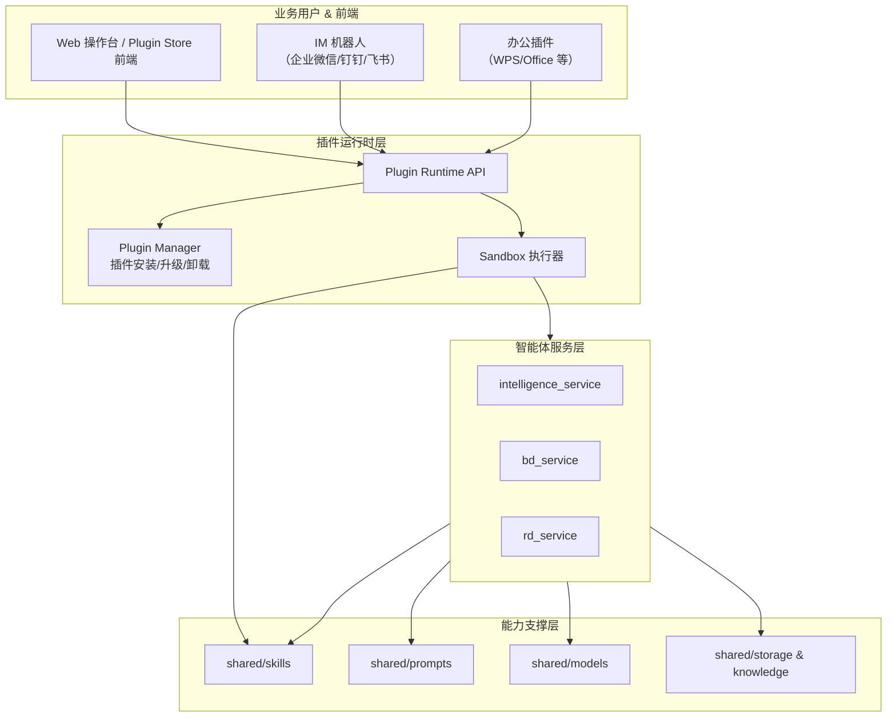
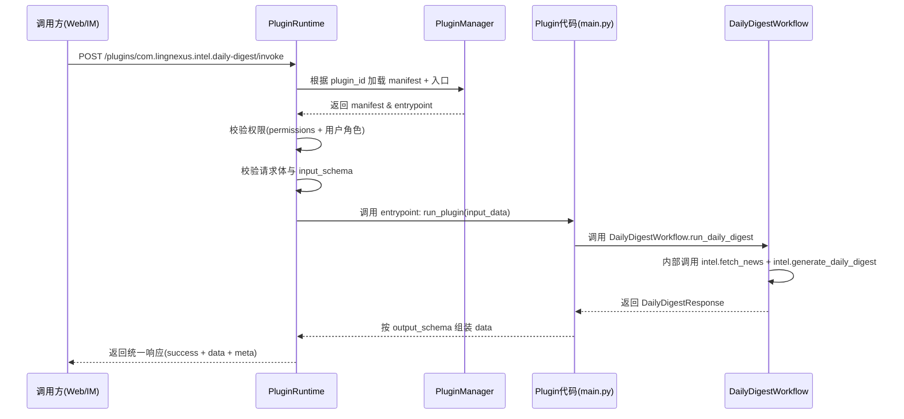

## LingNexus 插件体系阶段 1 设计稿（Plugin Runtime + 订阅日报插件）

> 本文档在现有 Skill 能力地图 v0.1 基础上，给出 LingNexus 插件体系的 **阶段 1 设计**：
> - 统一的 `plugin_manifest.json` 标准；
> - 插件运行时（Plugin Runtime）的最小 API 与调用流程；
> - 以「订阅日报 Quick Run」为代表的首个插件设计样例。
>
> 本设计稿仅涉及“概念与接口”，不包含具体代码实现细节。

---

### 一、插件体系总体定位

#### 1.1 目标

- 将现有 `shared/skills` 中的能力封装为 **可安装插件（Plugin）**；
- 提供一个统一的 **Plugin Runtime 服务**，作为 Web / IM / 第三方工具调用 AI 能力的入口；
- 保持现有分层架构不变：插件只调用 `core_agents/` 和 `shared/skills/` 暴露的已审核能力，不直接操作底层数据存储或模型。

#### 1.2 分层关系（逻辑视图）



---

### 二、插件规范：plugin_manifest.json 标准 v1

每个插件以一个目录或压缩包的形式存在，其中必须包含 `plugin_manifest.json`，用于描述插件元信息、输入输出、依赖 Skill 与权限等。

#### 2.1 文件结构示例（开发者视角）

```text
my_daily_digest_plugin/
├── plugin_manifest.json      # 必须：插件元信息 & 权限 & 输入输出规格
├── main.py                   # 必须：插件入口（run_plugin 函数或 Plugin 类）
├── README.md                 # 可选：插件说明
└── resources/                # 可选：图标、示例配置等
```

#### 2.2 标准字段定义

- **基础元信息**
  - `plugin_id` (*string*, required)：全局唯一 ID，如 `com.lingnexus.intel.daily-digest`；
  - `version` (*string*, required)：语义化版本号，例如 `1.0.0`；
  - `name` (*string*, required)：插件名称，如 `订阅日报 Quick Run`；
  - `description` (*string*, required)：插件的用途描述；
  - `author` (*string*, required)：作者或团队名称；
  - `category` (*string*, required)：业务域分类，如 `"intelligence" | "bd" | "rd" | "other"`；
  - `tags` (*string[]*, optional)：标签列表，便于在 Plugin Store 中检索。

- **能力相关**
  - `required_skills` (*string[]*, required)：列出插件直接依赖的 Skill ID，如 `['intel.fetch_news', 'intel.generate_daily_digest']`；
  - `entrypoint` (*string*, required)：运行时调用入口，格式 `"module:callable"`，例如 `"main:run_plugin"` 或 `"main:DailyDigestPlugin"`。

- **输入输出 Schema**
  - `input_schema` (*object*, required)：描述插件可接受参数，用于参数校验与自动表单生成；
  - `output_schema` (*object*, required)：描述插件输出的数据结构，用于调用方解析和类型检查。

- **权限模型**
  - `permissions` (*string[]*, required)：插件声明需要的能力级权限，例如：
    - `"read_pharma_news"`：允许读取 `pharma_news` 资讯索引；
    - `"call_llm_standard"`：调用常规 LLM；
    - `"call_llm_high_cost"`：调用成本较高的模型（可单独审批）。

#### 2.3 「订阅日报 Quick Run」插件 manifest 示例（草案）

```json
{
  "plugin_id": "com.lingnexus.intel.daily-digest",
  "version": "1.0.0",
  "name": "订阅日报 Quick Run",
  "description": "根据用户选择的主题和角色，一键生成情报订阅日报草稿。",
  "author": "LingNexus Team",
  "icon": "📰",
  "category": "intelligence",
  "tags": ["订阅", "日报", "情报", "RAG"],

  "required_skills": [
    "intel.fetch_news",
    "intel.generate_daily_digest"
  ],

  "entrypoint": "main:run_plugin",

  "input_schema": {
    "topics": {
      "type": "array",
      "items": {
        "type": "object",
        "properties": {
          "topic_id": {"type": "string", "required": false},
          "name": {"type": "string", "required": true, "description": "订阅主题名称，如“PD-1 肺癌"},
          "description": {"type": "string", "required": false},
          "keywords": {
            "type": "array",
            "items": {"type": "string"},
            "required": false,
            "description": "用于检索的关键词列表"
          },
          "max_items": {"type": "number", "required": false, "default": 5}
        }
      },
      "required": true
    },
    "role": {
      "type": "string",
      "required": true,
      "enum": ["bd", "med", "market", "rd", "general"],
      "description": "主要阅读角色"
    },
    "lang": {
      "type": "string",
      "required": false,
      "default": "zh-CN",
      "description": "输出语言（预留）"
    }
  },

  "output_schema": {
    "task_id": {"type": "string", "description": "内部任务 ID"},
    "items": {
      "type": "array",
      "items": {
        "type": "object",
        "properties": {
          "topic": {
            "type": "object",
            "properties": {
              "topic_id": {"type": "string"},
              "name": {"type": "string"},
              "max_items": {"type": "number"}
            }
          },
          "news": {
            "type": "array",
            "items": {
              "type": "object",
              "properties": {
                "id": {"type": "string"},
                "title": {"type": "string"},
                "summary": {"type": "string"},
                "source": {"type": "string"},
                "published_at": {"type": "string"},
                "url": {"type": "string"}
              }
            }
          },
          "digest_summary": {"type": "string", "description": "可直接推送的日报文本"},
          "role": {"type": "string"}
        }
      }
    }
  },

  "permissions": [
    "read_pharma_news",
    "call_llm_standard"
  ]
}
```

> 说明：
> - 该插件的输出结构与现有 `DailyDigestResponse` 保持高度一致，便于直接复用 Workflow；
> - 插件调用方可以只关心输入参数和输出字段，而不需要理解底层 Skill / Workflow 的细节。

---

### 三、Plugin Runtime 的最小接口与调用流程

#### 3.1 对外 API 设计（MVP）

- `GET /plugins`
  - 功能：列出当前用户有权限使用的插件列表；
  - 响应示例：
    ```json
    [
      {
        "plugin_id": "com.lingnexus.intel.daily-digest",
        "name": "订阅日报 Quick Run",
        "version": "1.0.0",
        "category": "intelligence",
        "icon": "📰",
        "description": "一键生成订阅日报草稿"
      }
    ]
    ```

- `GET /plugins/{plugin_id}/schema`
  - 功能：返回指定插件的 `input_schema` 与 `output_schema`，供 Web/IM 调用方动态生成表单、做参数校验；
  - 响应示例：
    ```json
    {
      "input_schema": { ... },
      "output_schema": { ... }
    }
    ```

- `POST /plugins/{plugin_id}/invoke`
  - 功能：执行指定插件；
  - 请求体：必须符合 `input_schema`；
  - 响应体：外层包一层统一格式，内层为 `output_schema` 定义的数据：
    ```json
    {
      "success": true,
      "data": {
        "task_id": "daily_20241220_001",
        "items": [
          {
            "topic": { "topic_id": "t1", "name": "PD-1 肺癌", "max_items": 5 },
            "news": [ { "id": "NEWS_0001", "title": "..." } ],
            "digest_summary": "这里是一整篇可直接推送的订阅日报文本",
            "role": "bd"
          }
        ]
      },
      "message": "",
      "meta": {
        "trace_id": "abc123",
        "duration_ms": 1234
      }
    }
    ```

#### 3.2 内部执行流程（以订阅日报插件为例）



> 说明：
> - 插件代码（`main.py`）可以选择：
>   - 直接通过 Python import 调用 `DailyDigestWorkflow.run_daily_digest`；
>   - 或通过 HTTP 调用 `intelligence_service` 的 `/v1/internal/daily_digest` 接口。
> - 运行时负责统一权限校验与审计日志记录。

---

### 四、「订阅日报 Quick Run」插件 main.py 接口约定

为方便不同插件统一集成，建议约定一个简单的插件入口接口：

- 函数式入口：
  ```python
  async def run_plugin(input_data: dict, context: dict | None = None) -> dict:
      """执行插件主逻辑。

      Args:
          input_data: 经过 input_schema 校验后的参数字典。
          context:    运行时上下文（可选），如当前用户、trace_id 等。

      Returns:
          dict: 符合 output_schema 的数据结构，由 Runtime 包装为统一响应。
      """
  ```

- 类式入口（可选）：
  ```python
  class DailyDigestPlugin:
      async def execute(self, input_data: dict, context: dict | None = None) -> dict:
          ...
  ```

对于「订阅日报 Quick Run」插件，`run_plugin` 的典型逻辑可以是：

1. 从 `input_data` 中读取 `topics` 和 `role`；
2. 构造 `DailyDigestRequest`（与现有 schema 对齐）；
3. 调用 `DailyDigestWorkflow.run_daily_digest(request)`；
4. 将返回的 `DailyDigestResponse` 转换为 manifest 中定义的 `output_schema` 结构；
5. 返回该结构，由 Runtime 嵌入到统一响应中。

---

### 五、阶段 1 小结与后续工作

#### 5.1 阶段 1 当前成果

- 定义了 **plugin_manifest.json 标准 v1**：
  - 明确基础元信息、能力相关字段、输入输出 Schema 与权限模型；
  - 给出了「订阅日报 Quick Run」插件的完整 manifest 草案。
- 设计了 **Plugin Runtime 的最小 API**：
  - `/plugins` 列表；
  - `/plugins/{plugin_id}/schema`；
  - `/plugins/{plugin_id}/invoke`。
- 以订阅日报场景为例，给出了 **插件调用 Workflow + Skill 的时序图** 和 `main.py` 入口接口建议。

#### 5.2 后续阶段建议

- 在代码层面新增：
  - `plugin_runtime/` 服务骨架（FastAPI/Flask 皆可），先实现 `/plugins` 与 `/invoke` 的基础逻辑；
  - 一个最简单的 PoC 插件目录（`my_daily_digest_plugin/`），内部直接调用现有 `DailyDigestWorkflow`。
- 在文档层面继续补充：
  - 对 BD / RD 域插件（"BD 机会评估"、"化合物一键分析"）给出类似的 manifest 草案和调用流程；
  - 在 `skill_capability_map_v0.1.md` 中加入 "Plugin Candidate" 一列的进一步说明（如潜在插件名称、预期用户）。

> 本设计稿可视为 LingNexus 插件体系的「阶段 1 蓝图」。后续可在此基础上逐步引入沙箱、安全策略、Plugin Store 前端等高阶能力。